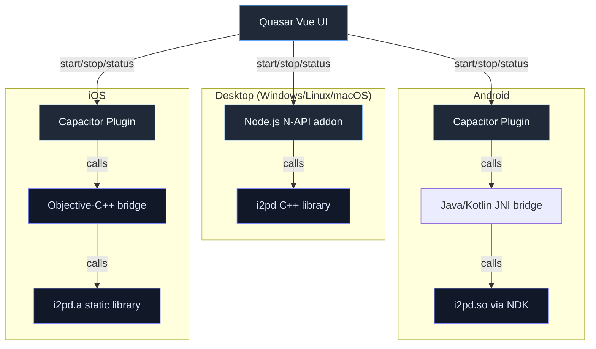

```mermaid
flowchart TD
    %% Frontend
    UI[Quasar Vue UI] -->|start/stop/status| AdapterDesktop
    UI -->|start/stop/status| AdapterAndroid
    UI -->|start/stop/status| AdapteriOS

    %% Desktop path
    subgraph Desktop["Desktop (Windows/Linux/macOS)"]
        AdapterDesktop[Node.js N-API addon]
        AdapterDesktop -->|calls| i2pdDesktop[i2pd C++ library]
    end

    %% Android path
    subgraph Android["Android"]
        AdapterAndroid[Capacitor Plugin]
        AdapterAndroid -->|calls| JNI[Java/Kotlin JNI bridge]
        JNI -->|calls| i2pdAndroid[i2pd.so via NDK]
    end

    %% iOS path
    subgraph iOS["iOS"]
        AdapteriOS[Capacitor Plugin]
        AdapteriOS -->|calls| ObjCXX[Objective-C++ bridge]
        ObjCXX -->|calls| i2pdiOS[i2pd.a static library]
    end

    %% Notes
    classDef frontend fill:#1f2937,stroke:#60a5fa,color:#f0faff
    classDef native fill:#111827,stroke:#818cf8,color:#e0e7ff
    class UI,AdapterDesktop,AdapterAndroid,AdapteriOS frontend
    class i2pdDesktop,i2pdAndroid,i2pdiOS,NJNI,ObjCXX native
```